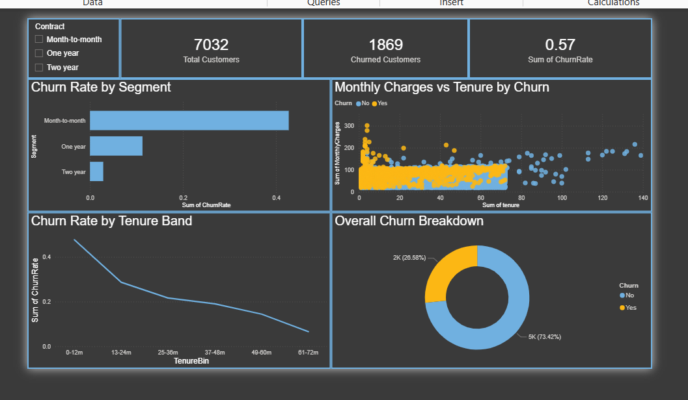
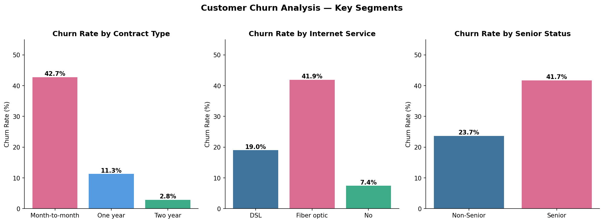
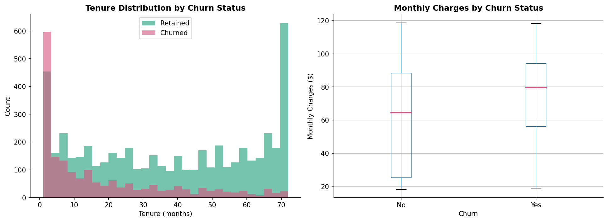
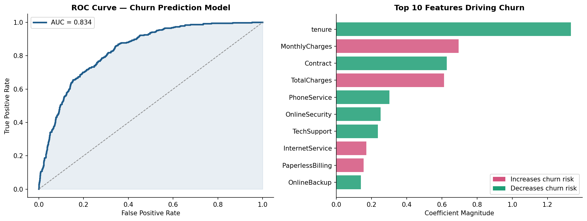

# 📉 Customer Churn Prediction & Analysis


An end-to-end customer churn analysis using the IBM Telco dataset. Covers exploratory data analysis, segmentation, a logistic regression churn prediction model (AUC = 0.834), an A/B hypothesis test, and a Power BI dashboard — all built in Python.

---

## 📊 Power BI Dashboard



---

## 🔍 Key Findings

| Metric | Value |
|---|---|
| Overall churn rate | 26.5% |
| Month-to-month churn rate | **42.7%** |
| Two-year contract churn rate | **2.8%** |
| Fiber optic churn rate | **41.9%** |
| Senior citizen churn rate | **41.7%** |
| Model ROC-AUC | **0.834** |
| Model accuracy | **79%** |
| A/B test p-value | **< 0.0001** |

**Notable insights:**
- 📋 Contract type is the strongest retention lever — two-year customers churn at **15x lower rate** than month-to-month
- ⏱️ Churn is heavily front-loaded — the majority of churned customers leave within the first 12 months
- 💰 Churned customers pay **higher** monthly charges ($80 median vs $65 for retained)
- 🔬 A/B test confirms month-to-month customers pay **$5.53 more per month** on average (p < 0.0001)
- 🧠 Tenure is the single strongest predictor of retention — the longer a customer stays, the less likely they are to leave
- 🔒 Customers without online security or tech support churn at significantly higher rates

---

## 📈 Visualisations

### Churn Rate by Key Segments


### Tenure & Monthly Charges Distribution


### Model Performance — ROC Curve & Feature Importance


---

## 🤖 Model Summary

**Algorithm:** Logistic Regression
**Train/Test split:** 80/20 (stratified)
**Preprocessing:** StandardScaler on all numeric features, LabelEncoder on categoricals

| Metric | Retained | Churned |
|---|---|---|
| Precision | 0.85 | 0.62 |
| Recall | 0.88 | 0.56 |
| F1-Score | 0.86 | 0.59 |
| **ROC-AUC** | **0.834** | — |

**Top churn predictors (by coefficient magnitude):**
1. `tenure` — longer tenure = significantly lower churn risk
2. `MonthlyCharges` — higher charges = higher churn risk
3. `Contract` — long-term contracts dramatically reduce churn
4. `TotalCharges` — proxy for customer lifetime value
5. `OnlineSecurity` / `TechSupport` — absence increases churn risk

---

## 🔬 A/B Hypothesis Test

**Question:** Do month-to-month customers pay significantly higher monthly charges than two-year contract customers?

| | Month-to-Month | Two Year |
|---|---|---|
| n | 3,875 | 1,685 |
| Mean charges | $66.40 | $60.87 |
| Std deviation | $26.93 | $34.71 |

**Result:** T-statistic = 6.42, **p-value < 0.0001**

✅ Reject H0 — month-to-month customers pay **$5.53 more per month** on average. The difference is statistically significant at the 99.99% confidence level.

---

## 🛠️ Tools & Technologies

| Category | Tools |
|---|---|
| Language | Python 3.8 |
| Data manipulation | Pandas, NumPy |
| Machine learning | Scikit-learn |
| Statistical testing | SciPy |
| Visualization | Matplotlib, Seaborn |
| Dashboard | Power BI |
| Dataset | IBM Telco Customer Churn (Kaggle) |

---

## 📁 Project Structure

```
customer-churn-analysis/
│
├── data/
│   ├── powerbi_main.csv                        # Cleaned data for Power BI
│   ├── powerbi_churn_segments.csv              # Churn rates by segment
│   └── powerbi_churn_tenure.csv                # Churn rates by tenure band
│
├── notebooks/
│   └── 01_eda.ipynb                            # Full analysis + model notebook
│
├── outputs/
│   └── charts/
│       ├── 01_churn_by_segment.png
│       ├── 02_tenure_charges.png
│       ├── 03_model_performance.png
│       └── dashboard_screenshot.png            # Power BI dashboard
│
└── README.md
```

---

## ▶️ How to Run

```bash
# Clone the repo
git clone https://github.com/Nunjpatel/customer-churn-analysis.git
cd customer-churn-analysis

# Create virtual environment
python -m venv venv
venv\Scripts\activate        # Windows
source venv/bin/activate     # Mac/Linux

# Install dependencies
pip install pandas numpy matplotlib seaborn scikit-learn scipy jupyter ipykernel

# Launch notebook
jupyter notebook notebooks/01_eda.ipynb
```

**Dataset:** [IBM Telco Customer Churn — Kaggle](https://www.kaggle.com/datasets/blastchar/telco-customer-churn)

---

## 🚀 What I'd Add Next

- Random Forest or XGBoost model for improved recall on churned class
- SHAP values for more interpretable feature importance
- Customer lifetime value (CLV) model to prioritise which churners to target
- Deploy model as a simple Flask API for real-time churn scoring

---

## 👤 Author

**Nunj Patel** · Data Analyst · Toronto, Canada
[LinkedIn](https://www.linkedin.com/in/nunjpatel/) · [GitHub](https://github.com/Nunjpatel) · nunjpatel@gmail.com
